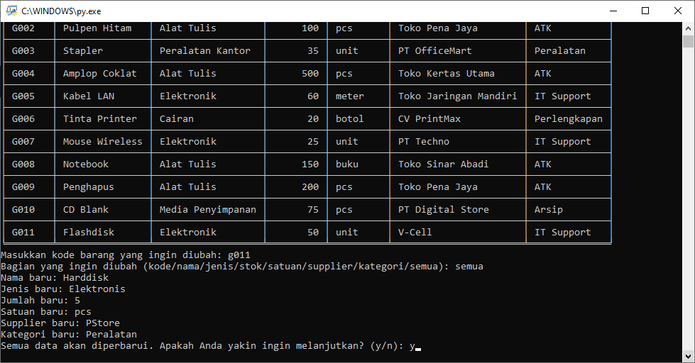
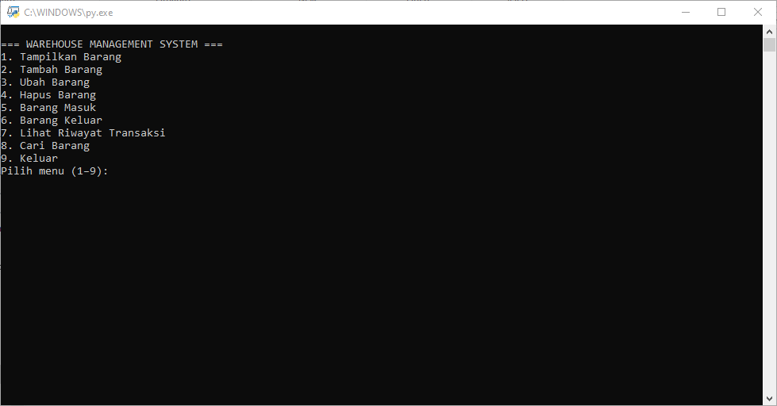

# Warehouse Management System (WMS)

This is a simple Python 3-based warehouse inventory system application that provides CRUD functionalities (Create, Read, Update, Delete), transaction history tracking (in/out), and keyword-based search. This project was developed as a foundational project for learning CRUD logic and inventory tracking.

> **Note**: This application interface and prompts are written in **Bahasa Indonesia**.
> Some function names and variables also use Bahasa Indonesia for local context learning.

---

## App Description

This mini app was created as part of a beginner's project to learn and practice how data structures, functions, validation, and user interaction work together in a real-world simulation.

The main goal is to **manage warehouse inventory** (adding, updating, deleting items), **track item movements**, and **view reports** — all using simple and readable Python code.

## Main Features

| No | Feature                 | Description                                                               |
|----|-------------------------|---------------------------------------------------------------------------|
| 1  | Tampilkan Barang        | Shows all warehouse inventory items in a tabular format.                  |
| 2  | Tambah Barang           | Adds new items to the warehouse.                                          |
| 3  | Ubah Barang             | Edits item data partially or completely.                                  |
| 4  | Hapus Barang            | Removes an item from the inventory.                                       |
| 5  | Barang Masuk            | Adds item stock and logs the staff responsible.                           |
| 6  | Barang Keluar           | Deducts item stock with stock validation and logs the staff responsible.  |
| 7  | Lihat Riwayat Transaksi | Displays item in/out transaction history.                                 |
| 8  | Cari Barang             | Searches items using keyword match.                                       |
| 9  | Keluar                  | Closes the program after confirmation.                                    |

---

## Data Structure

### Inventory Data

Stored as a dictionary:

```python
gudang = {
    "Code": ["Item Name", "Type", amount, "Unit", "Supplier", "Category"]
}
```

### Transaction Log

Stored as a list of lists:

```python
riwayat_transaksi = [
    ["In/Out", "Code", "Item Name", "Type", amount, "Unit", "Staff"]
]
```

---

## Program Architecture

### 1. Functions

- **Input Validation**
  - `input_kode(prompt)`, `input_teks(prompt)`, `input_angka(prompt)`  
    Input validation functions.

  - `konfirmasi(prompt)`  
    Prompts user for confirmation using `y/n`.
  
  The program uses helper functions like `input_kode()`, `input_teks()`, `input_angka()`, and `konfirmasi()` to maintain strict and consistent input validation.

- **Read**
  - `tampilkan_barang()`
    
  - `tampilkan_riwayat()`
    
  - `cari_barang()`
    

- **Create**
  - `tambah_barang()`
    

- **Update**
  - `ubah_barang()`
    
  - `barang_masuk()`
    
  - `barang_keluar()`
    

- **Delete**
  - `hapus_barang()`
    

- `menu()`  
  The main function for displaying and navigating the interactive menu.
  

### 2. Program Flow

1. Program starts from `menu()`.
2. Menu is displayed and waits for user input.
3. The selected option (1–9) will execute its corresponding function.
4. Each action is validated and confirmed by the user.
5. Transaction history is logged for stock in/out actions only.

---

## Search Capability

You can search inventory data by keywords across the following fields:

- Kode Barang
- Nama Barang
- Jenis
- Supplier
- Kategori

The search is **case-insensitive** and can match partial values.

---

## How to Run

### 1. Install Dependencies

This app uses the `tabulate` library to format output as tables.

```bash
pip install tabulate
```

### 2. Run the Program

```bash
python warehouse_management_system.py
```

---

## Example Input & Output

### Add Item
```text
Masukkan kode barang: G011
Masukkan nama barang: Kertas Folio
Masukkan jenis barang: Alat Tulis
...
Apakah Anda yakin ingin menambahkan data ini? (y/n): y
Barang berhasil ditambahkan.
```

### Stock Out
```text
Kode barang yang akan dikurangi stoknya: G003
Jumlah Stapler keluar: 5
Nama petugas (tidak boleh kososng): Bagas
Apakah Anda yakin ingin mencatat barang keluar ini? (y/n): y
Barang keluar dicatat.
```

---

## Limitations

- **Data is not persisted** – All data is stored in memory (RAM) and lost after program exits.
- **No file or database storage.**
- **No user authentication.**
- **No export or backup feature yet.**

---

## Additional Notes

This app is ideal for:
- Learning basic CRUD operations in Python.
- Simulating a small-scale warehouse system.
- A starting point for more advanced systems with database or UI integration.

---
